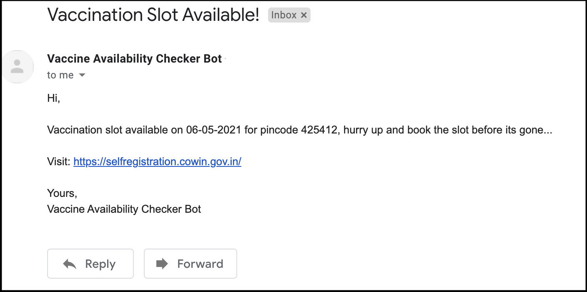

# CoWin Vaccine Availability Indicator Bot
Stay alert for vaccination slots in your area.

## Pre-requisites
1. Python v3.8+
2. Gmail Account (enable [2-step-verification](https://support.google.com/accounts/answer/185833?p=InvalidSecondFactor&visit_id=637554658548216477-2576856839&rd=1))

## How to run?
1. Clone this repo on your local machine
2. It's recommended to create a virtual environment for this project
3. Install required packages by executing below command in terminal:

    ```bash
   python -m pip install -r requirements.txt 
   ```
4. Create a copy of `.env.example` file and rename it to `.env`
5. Update `.env` as per your requirements
6. Run `vaccine-availability-checker.py` python script by executing below command in terminal:

    ```bash
   python vaccine-availability-checker.py 
   ```
   
**Now,** sit and relax... your robot will keep eye on the vaccination slots and let you know once it gets updated.



> Please refer [LICENSE](LICENSE) before using this project.
